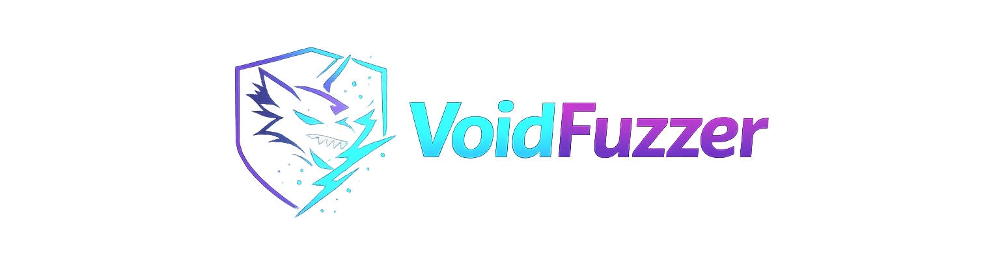

<p align="center">


</p>

<p align="center">



<h1 align="center">⚡ VoidFuzzer ⚡</h1>
</p>
<p align="center">
Advanced Automation Fuzzing Tool for Vulnerability Discovery
</p>

<p align="center">


</p>

## 🚀 About VoidFuzzer

VoidFuzzer is a professional automation fuzzing tool designed for offensive security professionals, bug bounty hunters, and penetration testers.

It automates the process of:

- URL collection
- Parameter discovery
- Live endpoint filtering
- Automated vulnerability scanning

VoidFuzzer integrates multiple powerful security tools into one automated workflow.

## ⚡ Core Features

✔ Automated URL collection  
✔ Query parameter discovery  
✔ Live endpoint filtering  
✔ Automated vulnerability scanning using nuclei  
✔ Parallel processing for faster execution  
✔ Fully automated fuzzing pipeline  
✔ Designed for bug bounty & pentesting  

<a href="https://github.com/silentfalcon/voidfuzzer"></a>


## 🧠 How VoidFuzzer Works (Workflow)

VoidFuzzer performs the following steps automatically:

### Step 1: Collect URLs

Uses:

```
gau
```

to collect historical URLs from multiple sources.


### Step 2: Filter Parameterized URLs

Uses:

```
uro
```

to extract only fuzzable URLs containing parameters.

Example:

```
https://example.com/page?id=123
```


### Step 3: Check Live URLs

Uses:

```
httpx-toolkit
```

to verify which URLs are alive.

Dead endpoints are removed.


### Step 4: Automated Vulnerability Scan

Uses:

```
nuclei
```

to perform automated DAST scanning.

Detects:

- XSS
- SQLi
- SSRF
- Open Redirect
- RCE
- Misconfigurations


## 📦 Requirements

Install required tools before using VoidFuzzer:

```
gau
uro
httpx-toolkit
nuclei
```

Install using:

```
go install github.com/lc/gau/v2/cmd/gau@latest

go install github.com/s0md3v/uro@latest

go install github.com/projectdiscovery/httpx/cmd/httpx@latest

go install github.com/projectdiscovery/nuclei/v3/cmd/nuclei@latest
```


## 💻 Installation

Clone repository:

```
git clone https://github.com/lucifer0xf/voidfuzzer.git
```

Enter directory:

```
cd voidfuzzer
```

Make executable:

```
chmod +x voidfuzzer.sh
```

Run tool:

```
./voidfuzzer.sh
```


## ⚙️ Usage

Run tool:

```
./voidfuzzer.sh
```

Enter target:

```
example.com
```

OR

```
targets.txt
```


## 📁 Output Files

VoidFuzzer generates:

```
filtered_urls.txt
```

Contains:

- Live fuzzable URLs


```
nuclei_results.txt
```

Contains:

- Vulnerabilities detected

## 🧪 Example Usage

```
./voidfuzzer.sh

Enter the target domain or subdomains list file: example.com
```

Output:

```
[INFO] Fetching URLs using gau...
[INFO] Filtering URLs...
[INFO] Checking live URLs...
[INFO] Running nuclei scan...
[INFO] Automation completed successfully!
```

---

## 🔧 Internal Commands Used

VoidFuzzer uses:

```
gau
```

URL collection

```
uro
```

URL filtering

```
httpx-toolkit
```

Live host detection

```
nuclei
```

Vulnerability scanning

---

## ⚡ Parallel Processing

VoidFuzzer uses:

```
xargs -P10
```

This allows:

- 10 parallel threads
- Faster scanning


## 🛡️ Designed For

- Bug bounty hunters
- Pentesters
- Red teamers
- Security researchers
- Offensive security engineers

---

## 📊 Tool Workflow Diagram

```
Target Input
    ↓
gau (collect URLs)
    ↓
uro (filter parameters)
    ↓
httpx (check live URLs)
    ↓
nuclei (scan vulnerabilities)
    ↓
Results Output
```


## ⚔️ Offensive Security Skills

```
Reconnaissance
Web Application Security
Automation & Fuzzing
API Security Testing
Vulnerability Research
Exploit Development
Red Team Operations
OSINT Intelligence
```


## ⚡ Cybersecurity Quote

```text
"Security is not a product, it's a process."
```

## 🌐 Connect With Me

<div align="center">
  <a href="https://x.com/rootxploit_0x">
    
  </a>
  <a href="https://www.instagram.com/rootxploit.0x/">
    
  </a>
  <a href="https://tryhackme.com/r/p/rootxploit.0x">
    
  </a>
  <a href="https://medium.com/@rootxploit0x">
    
  </a>
</div>

## 📊 GitHub Analytics

<p align="center">


</p>

<p align="center">


</p>
